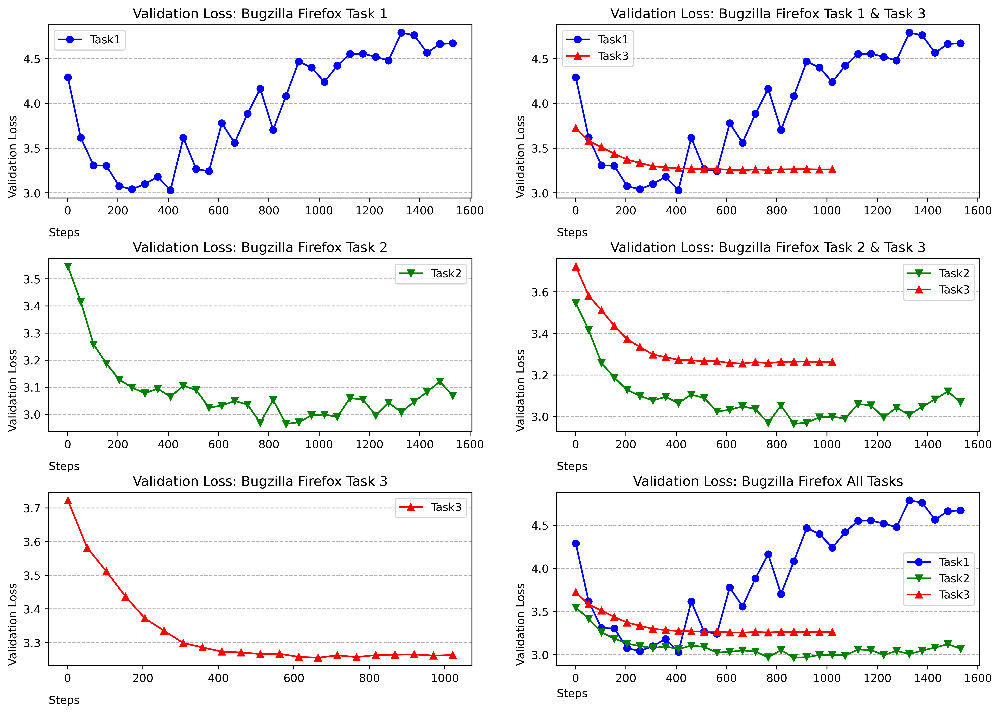

# Component-Prediction

## Introduction
This repository is for the research paper(Under review): Automatic Components Prediction for Issue Reports by using Fine-tuned Pre-trained Language Models.

## Gathering option
| Repository         |      Product     |          Option          |
|:-------------------|:----------------:|:------------------------:|
| Bugzilla           |      Firefox     | Resolved, Solved, Closed |
| Eclipse Foundation |     Community    | Resolved, Solved, Closed |
| Eclipse Platform   | Eclipse Projecet | Resolved, Solved, Closed |
## Result
| Dataset            | Collected Issues | Collected Components |
|:-------------------|:----------------:|:--------------------:|
| Bugzilla Firefox   |      19,870      |          77          |
| Eclipse Foundation |      21,644      |          41          |
| Eclipse Platform   |      18,886      |          19          |
### Task based method evaluation

## Reference
- Bugzilla_Firefox: https://bugzilla.mozilla.org
- Eclipse_Foundation & Eclipse_Platform: https://bugs.eclipse.org/bugs
